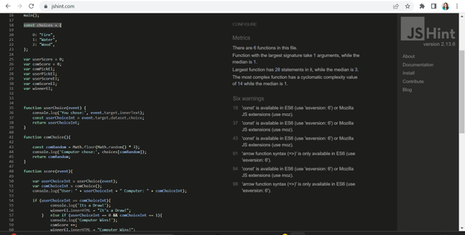

# Project 2 - Fire, Water, Wood

## Overview

A link to the live website is provided [here](https://matstaps.github.io/Portfolio-project-two/).

Fire, Water, Wood is a simple website designed to demonstrate javascript functions within a web-based page. It is based on the popular Rock, Paper, Scissors game. The website contains a header to introduce the page, and second level header to provide the user's instructions, a button section to allow the user to make a selection, a choice section to show the user's and computer's choice, a score accumulator section, a display to alert the winner of the last round, some images of the corresponding elements and a footer section.

This website intends to allow the users to play a simple Rock, Paper, Scissors type game, facilitated by the functions of JavaScript. 

This site was written using HTML, CSS and JavaScript. Additional text styling was provided using [Google Fonts](https://fonts.google.com/about) 

## User Experience

### User Stories
 
* First time users
            
    * To allow users to play a game in the style of Rock Paper Scissors.
    * To be able to easily navigate the page and find the relevant sections simply.
    * To record an ongoing result.           
    
            
* Returning users
    
    * To replay the game at their leisure.

    
* Frequent users
    
    * To play the game regularly.
            
## Features

### Existing Features

### H1 Header

* The header provides a clear naming of the page.
* The font is consitent with the website, and the colour palette contrasts with the background colour.
* This is a single page website with all elements visible, therefore a navigation bar is not required.

### Level 2 Heading

* This heading directs the user to make a choice from the available buttons to start the game.
* The font is consistent with the website, and the colour palette contrasts with the background colour.

### Button Section

* The button sections allows to user to make a choice of water, fire and wood. It triggers a JS function to select a random computer choice. 
* The font is consitent with the website, and the colour palette contrasts with the background colour. The button's colour compliments the background colour.

### Choice Sections

* This section shows the user the choice they have made and the corresponding computer choice.

### Score Section

* This section informs the user of the current accumulation of scores of both the user and computer.

### Winner Section

* This section alerts the user as to the winner of the most recent round.

### Hero Image Section

* This section gives a visual image of the three elements; fire, water, wood.
* It is to add aesthetic to the website and provide visual representation of the game.

### Footer

* This section provides a simple reminder of the rules of the game for the user.
* The section places a contrasting and complimentary background color to the rest of the webpage.

### Supporting the user experience

* The features intend to satisfy the aims mentioned in the user stories. This single page site is designed to be easily navigable. It is clearly themed with a consistent design throughout the page, and the textual elements are concise. It allows a user to play the game without unnecessary complication.

### Potential Future Features

#### Embedded animation content

* A future feature to be to animate the visual images in response to the user choice.

#### Limited Rounds

* The game could be limited to a number of rounds to determine an ulitmate winner.

## Design

### Website Style

* A single page format was chosen to this website, the intention being that it is easy for the user to navigate to each section or to scroll through the page.

### Imagery

* The images are freesourced from the internet. The images intend to visually convey the element's featured in the game.

### Colour Scheme

* The colour scheme is intended to be easily seen by the user and provide clear text. The scheme chosen was informed the colour tones of the images. The green/lime colour palette is intended to be sympathetic to the elements theme of the game. The background is of a light palette to allow the sections to stand out.

### Typography

* The Montserrat and Lato fonts were imported from Google Font. They are intended to present the website text with a simple and clean feel. These two fonts compliment one another well.

## Technologies used

### Languages

* HTML5
* CSS3
* JS

### Further Technologies

* Fonts were imported using Google Fonts.
* The code was written on Gitpod workspace, to commit and push to Github.
* Github was used as a repository for the code once pushed from Gitpod.
* JS Fiddle was used to try out ongoing javascript debugging.

## Testing

### Browser Testing

* I tested this site in different browsers: Chrome, Edge and Safari.
* I confirmed that this website was responsive across different devices using the Google Chrome devtools device toolbar.
* I confirm that this single page and contained sections, are readable, understandable and responsive.
* I performed some manual testing on various devices, including Windows Desktop, iPhone SE, iPad

### Bugs

* I can confirm that no bugs were detected upon deployment.

### Validator Testing

* HTML 

Upon validation using [W3C HTML Validation Service](https://validator.w3.org/#validate_by_input),  no errors were found.

* CSS

On first pass through the validator, invalid display values were found in the button and image container divs. This was amended to remove these errors in [Jigsaw CSS Validation Service](https://jigsaw.w3.org/css-validator/#validate_by_input).

* JS

On passing through the validator, version warnings were found although no errors were found in [JShint](https://https://jshint.com/).

* Accessibility

The colour scheme chosen was passed through the [Color Tool](https://m2.material.io/) website to check the color palette against accessibility.
I confirmed that color and fonts are accessible and easy to read by passing the website through Lighthouse in devtools.

*Lighthouse desktop results:

*Lighthouse mobile results: 

## Deployment

The site was deployed to Github, the steps as follows: 

1. In the github repository, navigate to the settings tab and choose Pages
2. From the Source section drop-down, select Master Branch and save
3. Once the page then refreshes, a link is provided to the live website
4. Further changes pushed to the main branch will update the live site

## Credits

### Content

Stylings, general HTML, CSS and JS coding techniques were learned from the [Code Institute](https://codeinstitute.net/) tutorials and the [W3 Schools](https://www.w3schools.com/) website.

### Media

Three images were sourced from the Pexel website:

[Logs](https://www.pexels.com/photo/brown-logs-761535/)

[Drop](https://www.pexels.com/photo/water-drop-40784/)

[Flame](https://www.pexels.com/photo/burning-tree-270815/)

### Acknowledgements

* Thank you to my mentor Akshat Garg for help and direction to useful resources.
* Thank you to the tutors and staff at Code Institute for continued support.

